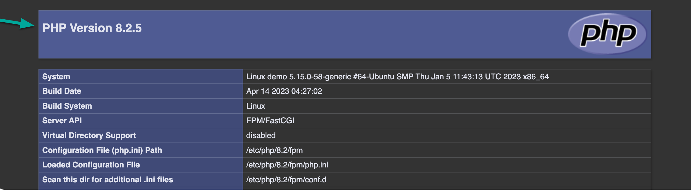

# Step-by-Step Guide: Deploy Laravel on Ubuntu Nginx server

## Introduction
Welcome to the step-by-step guide for Deployment of Project on Ubuntu Nginx server. Whether you're a beginner or an experienced user, this guide will walk you through the process of setting up Project on Ubuntu Nginx server.

This guide is designed to be easy to follow, providing detailed steps along with examples and illustrations where necessary. Before we dive into the setup process, make sure you have all the necessary prerequisites in place to ensure a smooth experience.

If you encounter any difficulties or have questions along the way, don't hesitate to refer to the additional resources section or reach out for support. Let's get started and make the setup process a breeze!

## Prerequisites
In this guide, we’ll learn how to deploy a Laravel application to an Ubuntu server running Nginx.

### Requirements:
1. **Laravel application:** A Laravel application that exists in a repository on Github.com
2. **Web server:** A web server running Nginx with SSH access
3. **Domain:** A domain or subdomain configured to point to that server

### Server Requirements
Before beginning the deployment, we need to check that our server meets all the requirements necessary to run Laravel, referencing the  [Laravel Server Requirement docs](https://laravel.com/docs/deployment#server-requirements).

You can confirm your PHP version meets the minimum version requirement by creating and running a page on your server that invokes the  `phpinfo()`  function.



Next, you need you make sure you have the required PHP extensions. Run  `php -m`  to output a list of the PHP extensions currently installed on your server. Example output:
```
php -m
[PHP Modules]
bcmath
bz2
calendar
Core
ctype
curl
date
dba
dom
exif
fileinfo
filter
ftp
gd
gettext
hash
iconv
imap
json
ldap
libxml
mbstring
mysqli
mysqlnd
openssl
pcntl
pcre
PDO
pdo_mysql
pdo_pgsql
pdo_sqlite
Phar
posix
Reflection
session
shmop
SimpleXML
soap
sockets
SPL
sqlite3
standard
sysvsem
sysvshm
tokenizer
xml
xmlreader
xmlwriter
xsl
zip
zlib

[Zend Modules]
```
If I cross check the above output from my server with the list of extensions listed on Laravel’s server requirements docs ([ref](https://laravel.com/docs/deployment#server-requirements)), I can see I’m missing the DOM and XML extensions:

**Laravel PHP extension requirements:**

-   ✅ Ctype PHP Extension
-   ✅ cURL PHP Extension
-   ❌ DOM PHP Extension
-   ✅ Fileinfo PHP Extension
-   ✅ Filter PHP Extension
-   ✅ Hash PHP Extension
-   ✅ Mbstring PHP Extension
-   ✅ OpenSSL PHP Extension
-   ✅ PCRE PHP Extension
-   ✅ PDO PHP Extension
-   ✅ Session PHP Extension
-   ✅ Tokenizer PHP Extension
-   ❌ XML PHP Extension

Additionally, I want to add the  _**zip**_  and  _**unzip**_  extensions Composer will use when downloading my dependencies, and the  _**MySQL**_  PHP extension since that’s the database type I’m using in my application.

I can accomplish this using  [apt](https://en.wikipedia.org/wiki/APT_(software)), a command line utility for managing packages on Linux systems.

First - I’ll specify a new repository  _apt_  can download software packages from. The repository we’re adding is  [ppa:ondrej/php](https://launchpad.net/~ondrej/+archive/ubuntu/php), the primary source for PHP-related packages.

```bash
> sudo add-apt-repository ppa:ondrej/php

```

Next, invoke  _apt_  to get the latest package lists from your apt repositories:

```bash
> sudo apt update

```

Finally, we can get the necessary extensions. In my case, the command to do that looks like the following.

```bash
> sudo apt install php8.2-xml php8.2-dom php8.2-mysql zip unzip 

```
Note that PHP-specific extensions are prefixed with  `php`  and the appropriate PHP version number. E.g. the XML PHP Extension is listed as  `php8.2-xml`. The extensions  `zip`  and  `unzip`  are not PHP-specific extensions, so no prefix is used.

## Get Composer

We need Composer in order to manage the dependencies in our Laravel project. If you invoke the command  `composer`  on your server and it tells you the command is not found, you’ll need to install Composer via the following instructions.

Move into your  `/usr/bin`  directory, a common location to put command line executable programs Linux servers:

```bash
> cd /usr/bin

```

Within this directory, run the following command to download the Composer installer and run it using php:

```bash
> curl -sS https://getcomposer.org/installer | sudo php

```

The resulting program (`composer.phar`) has a  `.phar`  (PHP Archive) extension. We can shorten this by renaming it to just composer:

```bash
> sudo mv composer.phar composer

```

Now we have a simple, terse command to invoke Composer. Test it out:

```bash
> composer
  / ____/___  ____ ___  ____  ____  ________  _____
 / /   / __ \/ __ `__ \/ __ \/ __ \/ ___/ _ \/ ___/
/ /___/ /_/ / / / / / / /_/ / /_/ (__  )  __/ /
\____/\____/_/ /_/ /_/ .___/\____/____/\___/_/
                    /_/

Usage:
  command [options] [arguments]

Options:
  -h, --help                     Display this help message
  -q, --quiet                    Do not output any message
[...etc...]
```
### Note:
Make sure to fulfill all the prerequisites listed above before proceeding with the setup. This will help ensure a smooth and successful setup process.

## Step 1: Get the code base
Now that our server is prepped to run Laravel, we can get a copy of our application on the server by cloning it from Github. In my example, I will clone it to my web directory at `/home/`

```bash
> cd /home/
> git clone git@github.com:project/demo.git
```
or
```bash
> cd /home/
> git clone -b [branch_name] [github_repo_url] [folder_name]
```
- **[branch_name]:** Name of the branch. For those that like to keep Production branch separate from Development and staging branches.
- **[github_repo_url]:** The url for the Github repo.
- **[folder_name]:** if you don't add one, the git command will set the repo name as the repo name as default.

Once this is done, I can move into the resulting directory:

```bash
> cd demo
```

## Get dependencies

Next, we need to pull in the application’s Composer dependencies (i.e. our  `vendor/`  directory).

If working on a  **production server**, use the following command so any development-specific dependencies are excluded and the version number of your dependencies match whatever was used in development and written to  `composer.lock`:

```bash
> composer install --optimize-autoloader --no-dev

```

If working on a  **development server**, use the following command so all dependencies are included and you get the latest versions within your version constraints listed in your  `composer.json`  file:

```bash
> composer update

```

With the above step complete, your project should now have a  `vendor/`  directory within your project.

## Build .env file

Every Laravel application needs a  `.env`  file with environment-specific configurations. Because the contents of this file are going to differ from environment to environment, it is not tracked as part of your version control repository (it’s ignored via the  `.gitignore`  config file) and therefor you have to manually create it whenever setting up the application in a new environment.

To do this, you can copy the provided  `.env.example`  file and update to as appropriate:

```bash
> cp .env.example .env

```

Run the following command to generate the  `APP_KEY`  value within your .env file:

```bash
> php artisan key:generate
```


## Set permissions

There are two directories within a Laravel application that need to be writable by the server:  `storage`  and  `bootstrap/cache`. Within these directories, the server will write application-specific files such as cache info, session data, error logs, etc.

To allow this to happen, you need to update the permissions of  `storage`  and  `bootstrap/cache`  so they are owned by the system user your web server is running as.

Run the following command to see which user your Nginx web server runs as:

```bash
> ps aux | grep "nginx: worker process" | awk '{print $1}' | grep -v root

```

On my server, the above command outputs the user  `www-data`  so I will update  `storage`  and  `bootstrap/cache`  to be owned by  `www-data`  with the following two commands:

```bash
> chown -R www-data storage

```

```bash
> chown -R www-data bootstrap/cache
```
## Configure site

At this point, everything is set up within our application, we just need to configure our server to run it.

Within  `/etc/nginx/sites-available/`  create a new file with the following content (ref:  _[Nginx deployment](https://laravel.com/docs/deployment#nginx)_). You can call the file whatever you want; I’ll name mine  `demo`  after the name of the app.

Within the content update the following:

-   `server_name`  should point to the domain (or subdomain) you’re using for this application
-   `root`  should point to the path of your Laravel application’s  `public`  directory
-   The reference to  `php8.2-fpm.sock`  should match whatever version of PHP your server is running

```nginx
server {
    listen 80;
    listen [::]:80;
    # or if you have multiple porjects that you want to on the same domain or sub-domain but use different ports
	#	listen 8087 default_server ssl;
    #	listen [::]:8087;    
# for adding ssl
#  ssl_certificate /etc/ssl/certs/[file_name].crt;
#  ssl_certificate_key /etc/ssl/private/[file_name].key;

    server_name demo.com;
    root /home/demo/public;
 
    add_header X-Frame-Options "SAMEORIGIN";
    add_header X-Content-Type-Options "nosniff";
 
    index index.php;
 
    charset utf-8;
 
    location / {
        try_files $uri $uri/ /index.php?$query_string;
    }
 
    location = /favicon.ico { access_log off; log_not_found off; }
    location = /robots.txt  { access_log off; log_not_found off; }
 
    error_page 404 /index.php;
 
    location ~ \.php$ {
        fastcgi_pass unix:/var/run/php/php8.2-fpm.sock;
        fastcgi_param SCRIPT_FILENAME $realpath_root$fastcgi_script_name;
        include fastcgi_params;
    }
 
    location ~ /\.(?!well-known).* {
        deny all;
    }
}

```

Next, to enable this config we need to symbolically link the file to the  `/etc/nginx/sites-enabled`  directory.

To do this, run the following command, replacing  `demo`  with the name of the file you created:

```bash
> sudo ln -s /etc/nginx/sites-available/demo /etc/nginx/sites-enabled

```

With that complete, run the command  `sudo nginx -t`  to check your configs making sure there are no issues:

```bash
> sudo nginx -t

```

Expected output:

```bash
nginx: the configuration file /etc/nginx/nginx.conf syntax is ok
nginx: configuration file /etc/nginx/nginx.conf test is successful

```

If all looks good, restart Nginx to make the changes take effect:

```bash
> systemctl restart nginx
```
## Firewall Premission:
Remeber to allow the port firewall access. To do this, run the following command:

```bash
> ufw allow [port_number]/tcp
```
## Test it

Load your application in the browser using the domain (or subdomain) you configured to make sure everything is working as expected. If your application fails to load, check out my guide  [Common Laravel Installation Issues](comming soon).

## Conclusion
Congratulations! You have successfully deployed your Laravel application on an Ubuntu Nginx server. Throughout this guide, we covered the essential steps required to set up your environment, configure the server, obtain the project codebase, install dependencies, and configure the Nginx web server to serve your application.

By following these steps, you've ensured that your Laravel application is running smoothly on your server, ready to be accessed by users. Remember to keep your server and application up to date with security patches and best practices.

If you encounter any issues or have questions, don't hesitate to refer back to this guide or seek additional resources for assistance. Now, sit back, relax, and enjoy your deployed Laravel application!

Feel free to explore further customization and optimization options to enhance the performance and functionality of your application. Happy coding!

## Additional Resources
There are no Additional Resources currently. Will add them if something comes up.

## Frequently Asked Questions (FAQs)
'Ask and it shall be added.'

## Feedback
I hope this step-by-step guide has been helpful in deploying your Laravel application on an Ubuntu Nginx server. Your feedback is incredibly valuable to us as it helps us improve our guides and provide better support to our users.

If you encountered any difficulties during the setup process, or if you have suggestions for how we can enhance this guide, please don't hesitate to let me know. Your feedback will help me and  others address any issues and make future guides even more effective.

Please take a moment to share your thoughts, suggestions, or any issues you encountered by reaching out to us via [email](napunjani@gmail.com) or through the support forum (coming soon). I greatly appreciate your input and look forward to hearing from you!

Thank you for choosing my guide, and  wish you success with your Laravel project deployment!
